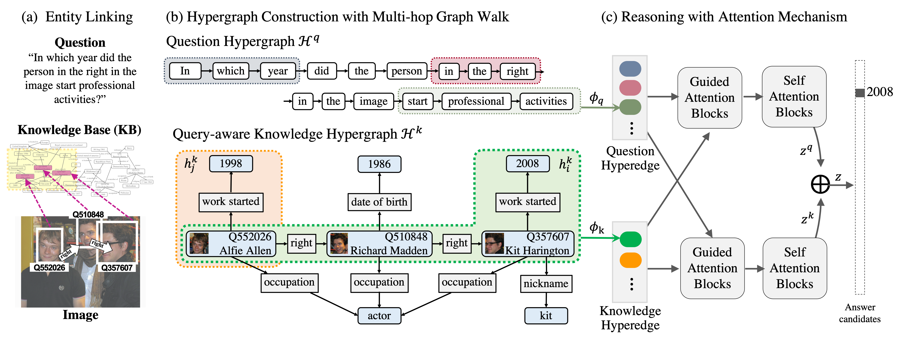

# Hypergraph Transformer: Weakly-supervised Multi-hop Reasoning for Knowledge-based Visual Question Answering
Source code for ACL 2022 paper: "Hypergraph Transformer: Weakly-supervised Multi-hop Reasoning for Knowledge-based Visual Question Answering", Yu-Jung Heo, Eun-Sol Kim, Woo Suk Choi, and Byoung-Tak Zhang
* [[Paper]](https://aclanthology.org/2022.acl-long.29.pdf) [[Slides]](https://www.dropbox.com/s/kkbmmm1sy7f1ldr/acl22_HGT_slides.pdf)

> To answer complex questions requiring multi-hop reasoning under weak supervision is considered as a challenging problem since i) no supervision is given to the reasoning process and ii) high-order semantics of multi-hop knowledge facts need to be captured. In this paper, we introduce a concept of hypergraph to encode high-level semantics of a question and a knowledge base, and to learn high-order associations between them. The proposed model, Hypergraph Transformer, constructs a question hypergraph and a query-aware knowledge hypergraph, and infers an answer by encoding inter-associations between two hypergraphs and intra-associations in both hypergraph itself. 



## Requirements
This code runs on Python 3.7 and PyTorch 1.5.1. We recommend using Anaconda to install all dependencies.
```
git clone https://github.com/YuJungHeo/kbvqa-public.git
conda env create --file environment.yml --name kbvqa
```

## Setup
Download preprocessed KVQA, PQ-{2H, 3H, M}, PQL-{2H, 3H, M} datasets.
```
bash download.sh
```

## Training

Train on KVQA dataset
* `--cfg` specifies a configuration yaml file.
* `--q_opt` specifies a question type among original (ORG) and paraphrased (PRP).
* `--n_hop` specifies a number of graph walk (e.g., 1-hop, 2-hop, and 3-hop).

```
# ORG, 3-hop on oracle setting
python main.py --model_name ht --cfg ht_kvqa --n_hop 3 --q_opt org --lr 0.00001 --exp_name ht_kvqa_org_3hop
```

Train on PathQuestions (PQ) dataset
```
# PQ-2H 
python main.py --data_name pq --model_name ht --cfg ht_pq2h --n_hop 2 --num_workers 2 --lr 0.0001 --abl_ans_fc --exp_name ht_pq2h
# PQ-3H 
python main.py --data_name pq --model_name ht --cfg ht_pq3h --n_hop 3 --num_workers 2 --lr 0.0001 --abl_ans_fc --exp_name ht_pq3h
# PQ-M (a mixture of the PQ-2H and PQ-3H questions)
python main.py --data_name pq --model_name ht --cfg ht_pqM --n_hop 3 --num_workers 2 --lr 0.0001 --abl_ans_fc --exp_name ht_pqM
```

Train on PathQuestions-Large (PQL) dataset
```
# PQL-2H
python main.py --data_name pql --model_name ht --cfg ht_pql2h --n_hop 2 --num_workers 2 --lr 0.0001 --abl_ans_fc --exp_name ht_pql2h --split_seed 789
# PQL-3H-More
python main.py --data_name pql --model_name ht --cfg ht_pql3h_more --n_hop 3 --num_workers 2 --lr 0.0001 --abl_ans_fc --exp_name ht_pql3h_more --split_seed 789
# PQL-M (a mixture of the PQL-2H and PQL-3H questions)
python main.py --data_name pql --model_name ht --cfg ht_pqlM --n_hop 3 --num_workers 2 --lr 0.0001 --abl_ans_fc --exp_name ht_pqlM --split_seed 789
```

Train on Fact-based VQA (FVQA) dataset
```
# There are five splits of train and test dataset. For split {0-4},
python main.py --data_name fvqa_sp{0-4} --model_name ht --cfg ht_fvqa --n_hop 1 --num_workers 0 --lr 0.0001 --wd 0.00001 --exp_name ht_fvqa_sp{0-4}
```

## Evaluation
We release the trained model checkpoints (1-hop, 2-hop, 3-hop on ORG and PRP questions) that we have used for our experiments on KVQA dataset.
```
bash download_kvqa_checkpoints.sh

# for original (ORG) questions on oracle setting in Table 1
python main.py --model_name ht --cfg ht_kvqa --n_hop 1 --q_opt org --exp_name ht_kvqa_org_1hop_dist --inference
python main.py --model_name ht --cfg ht_kvqa --n_hop 2 --q_opt org --exp_name ht_kvqa_org_2hop_dist --inference
python main.py --model_name ht --cfg ht_kvqa --n_hop 3 --q_opt org --exp_name ht_kvqa_org_3hop_dist --inference

# for phraphrased (PRP) questions on oracle setting in Table 1
python main.py --model_name ht --cfg ht_kvqa --n_hop 1 --q_opt prp --exp_name ht_kvqa_prp_1hop_dist --inference
python main.py --model_name ht --cfg ht_kvqa --n_hop 2 --q_opt prp --exp_name ht_kvqa_prp_2hop_dist --inference
python main.py --model_name ht --cfg ht_kvqa --n_hop 3 --q_opt prp --exp_name ht_kvqa_prp_3hop_dist --inference
```

We also release the trained model checkpoints that we have achieved best performance on the five repeated runs of different data splits in PQ and PQL dataset.
```
# for PQ dataset
bash download_pq_checkpoints.sh
python main.py --data_name pq --model_name ht --cfg ht_pq2h --n_hop 2 --num_workers 2 --abl_ans_fc --inference --exp_name ht_pq2h_dist
python main.py --data_name pq --model_name ht --cfg ht_pq3h --n_hop 3 --num_workers 2 --abl_ans_fc --inference --exp_name ht_pq3h_dist
python main.py --data_name pq --model_name ht --cfg ht_pqM --n_hop 3 --num_workers 2 --abl_ans_fc --inference --exp_name ht_pqM_dist

# for PQL dataset
bash download_pql_checkpoints.sh
python main.py --data_name pql --model_name ht --cfg ht_pql2h --n_hop 2 --num_workers 2 --abl_ans_fc --inference --exp_name ht_pql2h_dist --split_seed 789
python main.py --data_name pql --model_name ht --cfg ht_pql3h --n_hop 3 --num_workers 2 --abl_ans_fc --inference --exp_name ht_pql3h_dist --split_seed 789
python main.py --data_name pql --model_name ht --cfg ht_pql3h_more --n_hop 3 --num_workers 2 --abl_ans_fc --inference --exp_name ht_pql3h_more_dist --split_seed 789
python main.py --data_name pql --model_name ht --cfg ht_pqlM --n_hop 3 --num_workers 2 --abl_ans_fc --inference --exp_name ht_pqlM_dist --split_seed 789
```

In addition, we release the trained model checkpoints that we have used for our experiments on FVQA dataset.
```
bash download_fvqa_checkpoints.sh
CUDA_VISIBLE_DEVICES=0 python main.py --data_name fvqa_sp{0-4} --model_name ht --cfg ht_fvqa --n_hop 1 --num_workers 0 --lr 0.0001 --wd 0.00001 --inference --exp_name ht_fvqa_sp{0-4}_dist
```

## Credits
* Parts of the code were adapted from [Multimodal Transformer](https://github.com/yaohungt/Multimodal-Transformer) by Yao-Hung Hubert Tsai.

## Citation
```
@inproceedings{heo-etal-2022-hypergraph,
    title = "Hypergraph {T}ransformer: {W}eakly-Supervised Multi-hop Reasoning for Knowledge-based Visual Question Answering",
    author = "Heo, Yu-Jung and Kim, Eun-Sol and Choi, Woo Suk and Zhang, Byoung-Tak",
    booktitle = "Proceedings of the 60th Annual Meeting of the Association for Computational Linguistics (Volume 1: Long Papers)",
    month = may,
    year = "2022",
    address = "Dublin, Ireland",
    publisher = "Association for Computational Linguistics",
    url = "https://aclanthology.org/2022.acl-long.29",
    pages = "373--390"
}
```